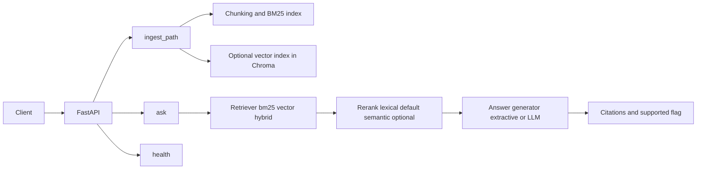

# Public Health RAG Assistant

## Production-Style RAG Assistant for Public Health (Citations, Abstention, Evaluation)

In this project, I build a focused Retrieval-Augmented Generation (RAG) system over UK public health reports.

The goal is not to make the system large or overly complex, but to show how to produce grounded answers with citations, support explicit abstention when the evidence is insufficient, and use evaluation to iteratively improve answer quality.

The API is intentionally minimal, with just a few endpoints (`/ingest_path`, `/ask`, and `/health`), so the system stays easy to reason about, test, and extend.

### What's Covered

- Document ingestion, chunking, and indexing
- Hybrid retrieval with lightweight lexical reranking
- LLM-based answer generation with source grounding
- Returning traceable evidence alongside answers
- Handling unsupported questions through explicit abstention ("I don't know")
- A lightweight evaluation setup using a 20-question benchmark

### Results

- Answer quality improved from ~0.51 to ~0.67 (~33% relative improvement)
- More consistent citation-backed responses
- Fewer unsupported or speculative answers

This is a small project, but it reflects how I approach building LLM systems in practice: keep the surface area small, make outputs verifiable, and use evaluation to guide improvements.

### Tech

FastAPI · Python · Hybrid Retrieval · RAG · LLMs

## Design Goals

- Ground answers in retrieved evidence and always return citations when supported.
- Abstain explicitly when evidence is weak or missing.
- Keep the service surface area small and inspectable.
- Use evaluation scripts to compare retrieval/generation choices before changing defaults.

## Architecture and Flow



Retrieval details:

- `bm25`: pure lexical retrieval from `.rag/index.json`.
- `vector`: embedding retrieval from Chroma.
- `hybrid`: BM25 + vector candidates fused with Reciprocal Rank Fusion (`rrf`).
- Reranking runs after retrieval; default is lexical (`semantic` is optional).

## API

### `GET /health`

Returns service status.

### `POST /ingest_path`

Indexes documents from a local directory.

Request body:

```json
{
  "source_dir": "docs/sample",
  "index_path": ".rag/index.json"
}
```

Notes:

- Supported file types: `.pdf`, `.txt`, `.md`, `.markdown`.
- BM25 indexing is always built; vector indexing is attempted.
- Ingestion continues if vector indexing is unavailable.

### `POST /ask`

Answers a question using retrieved context.

Request body (example):

```json
{
  "question": "What are the main public health priorities identified in these reports, and what evidence supports them?",
  "index_path": ".rag/index.json",
  "retriever": "hybrid",
  "rerank_mode": "lexical",
  "rerank_candidate_k": 20,
  "use_llm": true,
  "model": "gpt-4.1-mini",
  "top_k": 5
}
```

Response shape:

```json
{
  "answer": "...",
  "supported": true,
  "citations": [
    {
      "label": "[1]",
      "source": "...pdf",
      "page": 7,
      "chunk_id": "...#p7#c0",
      "score": 0.73,
      "preview": "..."
    }
  ],
  "reason": null,
  "retriever_used": "hybrid",
  "top_k": 5,
  "timings_ms": {
    "retrieve": 42,
    "generate": 3,
    "total": 45
  }
}
```

Insufficient evidence response:

```json
{
  "answer": "I don't know based on the indexed public health evidence.",
  "supported": false,
  "citations": [],
  "reason": "insufficient_evidence"
}
```

## Setup and Run

### 1. Install dependencies

```bash
pip install -r requirements.txt
```

### 2. Start the API

```bash
uvicorn api.main:app --reload
```

### 3. Ingest sample reports

```bash
curl -X POST http://127.0.0.1:8000/ingest_path \
  -H "Content-Type: application/json" \
  -d '{"source_dir":"docs/sample","index_path":".rag/index.json"}'
```

### 4. Ask a question

```bash
curl -X POST http://127.0.0.1:8000/ask \
  -H "Content-Type: application/json" \
  -d '{"question":"What disease notifications are highlighted?","index_path":".rag/index.json","retriever":"hybrid","top_k":5,"rerank_mode":"lexical","rerank_candidate_k":20,"use_llm":false}'
```

## Optional LLM Mode

Set `OPENAI_API_KEY` to enable `use_llm=true` generation and vector/hybrid embeddings.
Without an API key, BM25-only workflows still run.
Use `.env.example` for local configuration.

## Evaluation Summary

Evaluation assets are in `evaluation/` and `scripts/`.
Local run snapshot (heuristic scoring, 20-question set):

| Configuration        | Overall Score | Avg Total Latency |
| -------------------- | ------------: | ----------------: |
| Extractive answers   |         0.507 |             1.16s |
| LLM grounded answers |         0.675 |             7.27s |

Hybrid fusion (LLM mode, same dataset): legacy BM25-first merge `0.673` vs RRF `0.638`.

## Limitations and Non-Goals

- Not a production deployment template (no auth, tenancy, persistence strategy, or monitoring stack).
- Uses heuristic evaluation metrics, not human adjudication.
- Corpus is intentionally narrow (sample UKHSA Health Protection Reports).
- Retrieval quality depends on chunking/index settings and benchmark composition.
- `/ingest_path` currently accepts local filesystem paths only.

## License and Data Notes

- Sample report PDFs are sourced from GOV.UK publications and remain subject to their original licensing/terms.
